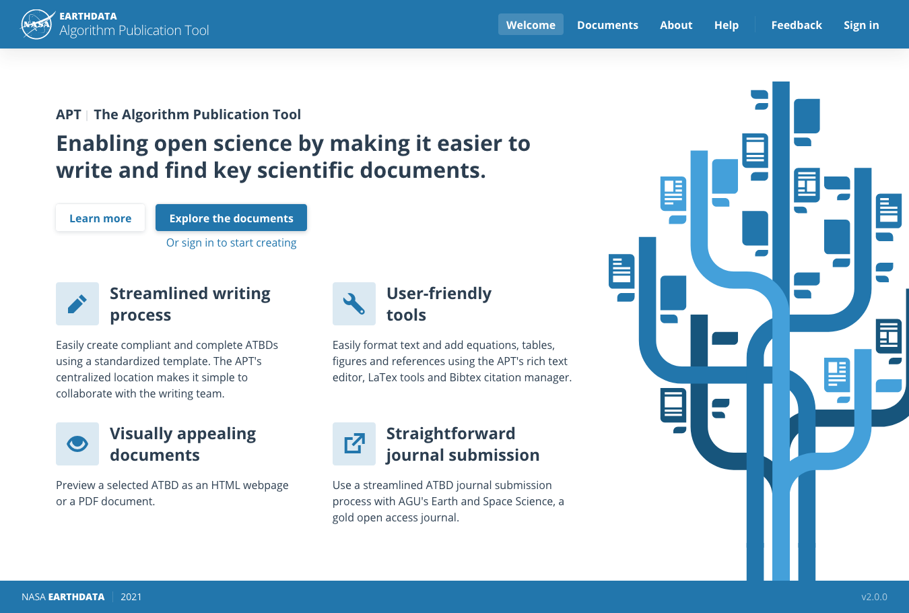

# Algorithm Publication Tool (APT)
_version 2_

The APT is an authoring tool that streamlines the writing, publishing and maintenance process of Algorithm Theoretical Basis Documents (ATBDs) for NASA’s Earth Science Division.

- interested in configuring APT? Check the [docs](./docs/README.md) section
- want to run the project locally? Check [DEVELOPMENT](DEVELOPMENT.md)

# License

This project is licensed under **The MIT License (MIT)**, see the [LICENSE](LICENSE) file for more details.
