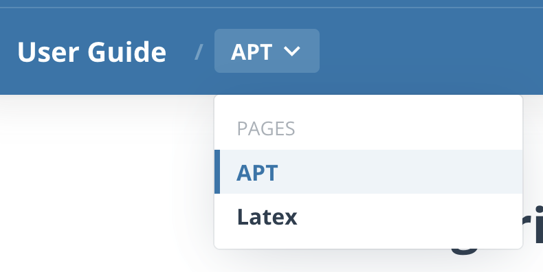
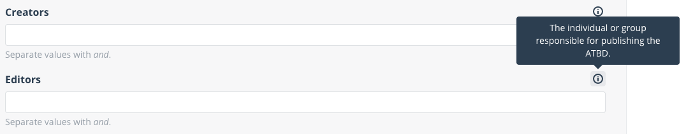

# Algorithm Publication Tool (APT)

## User guide
The `User Guide` section on the APT website can be customized using [markdown](https://www.markdownguide.org/) files found in `/content/help-documentation`.

Each file will result in a new page accessible through a dropdown in the site header.



The file name will be used as in the url to access the page. For example, a page called `latex.md` will be accessible in the site at `<domain>/user-guide/latex`. The name should uniquely identify the page and contain only letters, numbers, and dashes.

The page content starts with the `Front Matter` before the main content.
The `Front Matter` must be the first thing in the file and must take the form of valid YAML set between triple-dashed lines. Here is a basic example:
```yml
---
title: The human readable name of this page
---
After the Front Matter comes the post content.
```
Each help page must have a `title` attribute. This is the value that will be rendered inside the dropdown navigation.

## Form strings
Each form field on APT can have a quick one sentence description that is shown on a tooltip.



All these strings can be configured through a series of `yml` files found in `/content/strings`.
If a description is not needed for a given field, just leave it empty and the application will hide it.